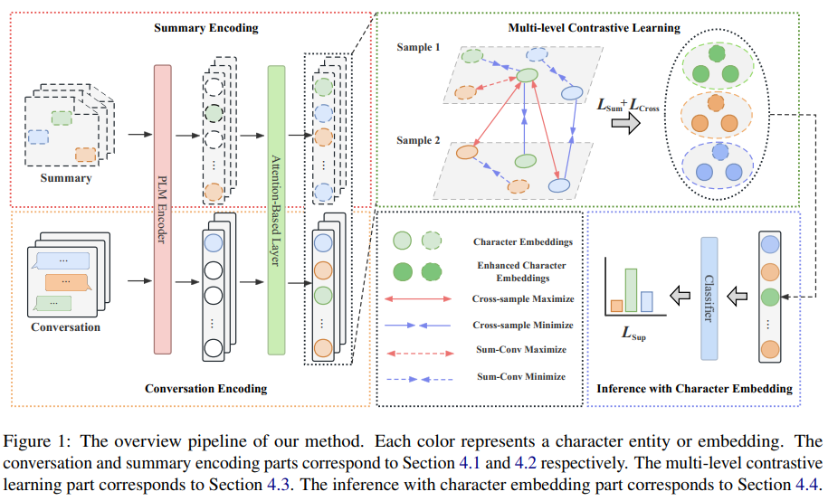

<div align="center">

# Multi-level Contrastive Learning for Script-based Character Understanding

</div>

### Overview

<p align="center">
  
</p>


### Dependency

To run our multi-level contrastive learning framework in each individual task, please first install the require packages from the original repositories [here](https://github.com/HKUST-KnowComp/C2) and [here](https://github.com/YisiSang/TVSHOWGUESS).

### Data

You can download the processed data [here](https://drive.google.com/drive/folders/1oKz3_suw9I0zeUbjR3tta3UCbaK9h9GD?usp=drive_link) directly.

For character linking and coreference resolution, put the files in original_data into [`character linking & coreference_resolution/data`](character linking & coreference_resolution/data), and put the files in data into [character linking & coreference_resolution/joint_model/data](character linking & coreference_resolution/joint_model/data).

For character guessing, put the files in dataset into [character guessing/dataset](character guessing/dataset).

### Run

#### Character Linking & Coreference Resolution

To get C2 result in character linking and coreference resolution, run
```
cd character linking & coreference resolution/joint_model
bash train.sh
```


#### Character Guessing
TBA

### Results with LLMs

We also include the code to inference each dataset with ChatGPT. You will first need to add you OpenAI API key into [inference_api.py](character linking & coreference resolution/joint_model/inference_api.py).

For character linking and coreference resolution, run
```
cd character linking & coreference resolution/joint_model
python inference_api.py
```

For character guessing, run
```
cd character guessing
python inference_api.py
```


Credits: This work began as a fork of the [C2](https://github.com/HKUST-KnowComp/C2) and [TVSHOWGUESS](https://github.com/YisiSang/TVSHOWGUESS) repository. If you found our code useful, please consider citing:

```
@inproceedings{li-etal-2023-multi-level,
    title = "Multi-level Contrastive Learning for Script-based Character Understanding",
    author = "Li, Dawei  and
      Zhang, Hengyuan  and
      Li, Yanran  and
      Yang, Shiping",
    editor = "Bouamor, Houda  and
      Pino, Juan  and
      Bali, Kalika",
    booktitle = "Proceedings of the 2023 Conference on Empirical Methods in Natural Language Processing",
    month = dec,
    year = "2023",
    address = "Singapore",
    publisher = "Association for Computational Linguistics",
    url = "https://aclanthology.org/2023.emnlp-main.366",
    doi = "10.18653/v1/2023.emnlp-main.366",
    pages = "5995--6013",
    abstract = "In this work, we tackle the scenario of understanding characters in scripts, which aims to learn the characters{'} personalities and identities from their utterances. We begin by analyzing several challenges in this scenario, and then propose a multi-level contrastive learning framework to capture characters{'} global information in a fine-grained manner. To validate the proposed framework, we conduct extensive experiments on three character understanding sub-tasks by comparing with strong pre-trained language models, including SpanBERT, Longformer, BigBird and ChatGPT-3.5. Experimental results demonstrate that our method improves the performances by a considerable margin. Through further in-depth analysis, we show the effectiveness of our method in addressing the challenges and provide more hints on the scenario of character understanding. We will open-source our work in this URL.",
}
```